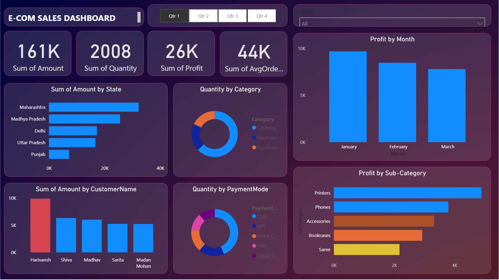

# Sales Dashboard

Welcome to the Sales Dashboard project! This Power BI dashboard provides an in-depth analysis of sales data using information from two datasets: `Orders.csv` and `Details.csv`. This project is tailored for beginners, offering a hands-on approach to creating a dynamic and interactive sales dashboard in Power BI.



## Project Overview

The Sales Dashboard is designed to visualize key metrics and trends in sales data, helping users gain insights into sales performance across different dimensions such as state, category, customer, and payment mode.

### Data Sources

- **Orders.csv**: This file contains the following columns:
  - `Order ID`: Unique identifier for each order.
  - `Order Date`: The date the order was placed.
  - `Customer Name`: The name of the customer who placed the order.
  - `State`: The state where the order was delivered.
  - `City`: The city where the order was delivered.

- **Details.csv**: This file contains detailed information about each order, with the following columns:
  - `Order ID`: Unique identifier corresponding to the order in `Orders.csv`.
  - `Amount`: The total amount for the order.
  - `Profit`: The profit earned from the order.
  - `Quantity`: The quantity of items ordered.
  - `Category`: The category of the products in the order.
  - `Sub-Category`: The sub-category of the products.
  - `PaymentMode`: The payment mode used for the order.

### Dashboard Features

The dashboard includes the following visualizations:

- **Sum of Amount by State**: A bar chart showing the total sales amount by state.
- **Quantity by Category**: A doughnut chart displaying the quantity of products sold, grouped by category.
- **Sum of Amount by Customer Name**: A column graph highlighting the total sales amount attributed to each customer.
- **Quantity by Payment Mode**: A doughnut chart showing the quantity of products sold, segmented by payment mode.
- **Profit by Month**: A column graph illustrating the profit trends over each month.
- **Profit by Sub-Category**: A bar chart detailing profit across different product sub-categories.

### Filters

The dashboard also includes filters to help users drill down into specific segments of the data:

- **Quarters (Q1-Q4)**: Filter the data by specific quarters of the year.
- **State**: Filter the data by state to view region-specific insights.

## Getting Started

To view and interact with the Sales Dashboard:

1. **Download Power BI Desktop**: If you don't have Power BI Desktop installed, you can download it from the [official website](https://powerbi.microsoft.com/desktop/).
2. **Clone the Repository**: Download or clone this repository to your local machine.
   ```bash
   git clone https://github.com/Gitkakkar1597/Power-BI-Dashboards.git
   ```
3. **Open the Dashboard**: Open the `Sales Dashboard.pbix` file using Power BI Desktop to explore the dashboard.
4. **Load Data**: Ensure that `Orders.csv` and `Details.csv` are loaded correctly in the data model.

## Usage

- **Interactive Filtering**: Use the top filters to analyze the data by quarters or specific states.
- **Drill-Down**: Click on the visual elements to drill down into more detailed data.
- **Exporting**: Export visuals for reports or presentations.

## Learning Objectives

By completing this project, you'll learn how to:

- Import and transform data from CSV files into Power BI.
- Create relationships between multiple tables in Power BI.
- Design and customize visuals like maps, bar charts, and line charts.
- Implement interactive filters to enhance data exploration.
- Analyze sales performance using a variety of metrics.

## Additional Resources

For more information on using Power BI, check out these resources:

- [Power BI Documentation](https://docs.microsoft.com/power-bi/)
- [Power BI Tutorials](https://www.youtube.com/user/mspowerbi)
- [Data Modeling Best Practices](https://docs.microsoft.com/power-bi/guidance/star-schema)

## Contributing

If you'd like to contribute to this project, feel free to submit a pull request or open an issue.
